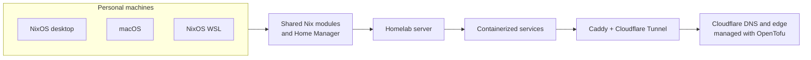

# Personal Infrastructure as Code

> Reproducible Nix configurations for my machines, homelab, and Cloudflare edge, kept declarative, version-controlled, and close at hand.

[](https://github.com/Nitestack/infrastructure/actions/workflows/check.yml)
[](https://github.com/Nitestack/infrastructure/stargazers)
[](https://github.com/Nitestack/infrastructure/commits/main)
[](https://github.com/Nitestack/infrastructure)
[](LICENSE)
[](https://nixos.org/)

This repository is my personal infrastructure, managed as code: reproducible [Nix](https://nixos.org)/[Home Manager](https://nix-community.github.io/home-manager) system configurations for [NixOS](https://nixos.org) (including [NixOS via WSL](https://nix-community.github.io/NixOS-WSL)) and [macOS](https://apple.com/macos), a self-hosted homelab of containerized services, and the [OpenTofu](https://opentofu.org)/Cloudflare edge that fronts them.

## How it fits together



## What’s in here

- **System and user configs** — `configurations/` and `modules/` define NixOS, nix-darwin, and Home Manager setups for every host, wired together via [nixos-unified](https://github.com/srid/nixos-unified).
- **Homelab services** — `modules/nixos/homelab/` is the module API for declaring self-hosted apps, their containers, and how traffic reaches them through Caddy, DNS, and Cloudflare Tunnel. See [`docs/homelab-services.md`](docs/homelab-services.md).
- **Edge and DNS as code** — `opentofu/cloudflare/` manages Cloudflare-side DNS and zone settings with OpenTofu. See [`opentofu/cloudflare/README.md`](opentofu/cloudflare/README.md).
- **Secrets** — `secrets/` stores encrypted secrets with [sops-nix](https://github.com/Mic92/sops-nix), scoped per host via `.sops.yaml`.
- **Automation** — GitHub Actions CI (`.github/workflows/`) and Renovate keep the flake and container images up to date; see [`docs/renovate-setup.md`](docs/renovate-setup.md).

## Requirements

Make sure [`git`](https://git-scm.com) is available when you follow the installation sections below.

### NixOS

Install the latest version of [NixOS](https://nixos.org/download).

Either run the graphical installer or install NixOS manually.

### WSL (NixOS)

Install the latest version of [WSL](https://learn.microsoft.com/windows/wsl).

Download `nixos.wsl` from [the latest release](https://github.com/nix-community/NixOS-WSL/releases/latest).

Either double-click the file or run:

```nu
wsl --install --from-file nixos.wsl # wherever nixos.wsl was downloaded
```

#### Post-install

After the initial installation, update your channels to use `nixos-rebuild`:

```nu
sudo nix-channel --update
```

If you want to make NixOS your default distribution, run:

```nu
wsl -s NixOS
```

### macOS

Install the latest version of [macOS](https://apple.com/macos) and [Nix](https://nixos.org).

Install Nix with the [Nix Installer from Determinate Systems](https://determinate.systems):

```sh
curl -fsSL https://install.determinate.systems/nix | sh -s -- install
```

## Getting started

Clone the repository:

```nu
git clone https://github.com/Nitestack/infrastructure.git
```

### NixOS

Before continuing with the installation, initialize the Nix system:

```sh
sudo nixos-rebuild boot --flake ~/infrastructure#nixstation
```

Reboot the system.

### Server (NixOS)

Before continuing with the installation, initialize the Nix system:

```sh
sudo nixos-rebuild boot --flake ~/infrastructure#homestation
```

Reboot the system.

### macOS

Before continuing with the installation, initialize the Nix system:

```sh
sudo nix run nix-darwin/master#darwin-rebuild -- switch --flake ~/infrastructure#macstation
```

Reboot the system.

### WSL (NixOS)

Initialize the Nix system inside of NixOS-WSL:

```sh
sudo nixos-rebuild boot --flake ~/infrastructure#wslstation
```

Execute the following commands on Windows to correctly apply the custom username:

```nu
wsl -t NixOS
wsl -d NixOS --user root exit
wsl -t NixOS
```

Restart WSL.

## Start here

This is personal infrastructure, not a drop-in distribution. It is useful as a reference or starting point, but before applying it elsewhere, replace host names, hardware configuration, secrets, DNS zones, and service-specific settings with your own.

For a guided first deployment, start with the [NixOS manual](https://nixos.org/manual/nixos/stable/) or [nix-darwin](https://github.com/nix-darwin/nix-darwin), then adapt the closest host under [`configurations/`](configurations/).

## Hosts at a glance

| Target | Role | Apply or evaluate with |
| --- | --- | --- |
| `nixstation` | Primary NixOS desktop | `sudo nixos-rebuild boot --flake .#nixstation` |
| `homestation` | NixOS homelab server | `sudo nixos-rebuild boot --flake .#homestation` |
| `macstation` | macOS via nix-darwin | `sudo darwin-rebuild switch --flake .#macstation` |
| `wslstation` | NixOS under WSL | `sudo nixos-rebuild boot --flake .#wslstation` |

## Everyday maintenance

```sh
# Format Nix files
nix fmt

# Check formatting and evaluate the flake without building full systems
nix run .#check

# Smoke-test the primary NixOS host
nix eval .#nixosConfigurations.nixstation.config.system.build.toplevel.drvPath --no-write-lock-file

# Smoke-test the macOS host
nix eval .#darwinConfigurations.macstation.system --apply 's: s.drvPath' --no-write-lock-file
```

## Further reading

- [`docs/homelab-services.md`](docs/homelab-services.md) — homelab module options, validation, and recipes.
- [`docs/adguard-home-client-caveats.md`](docs/adguard-home-client-caveats.md) — AdGuard Home client configuration caveats.
- [`docs/renovate-setup.md`](docs/renovate-setup.md) — one-time Renovate GitHub App setup.
- [`opentofu/cloudflare/README.md`](opentofu/cloudflare/README.md) — Cloudflare edge and DNS state with OpenTofu.

## License

Licensed under the [Apache License 2.0](LICENSE).
