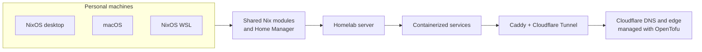

# Personal Infrastructure as Code

> Reproducible Nix configurations for my machines, homelab, and Cloudflare edge—kept declarative, version-controlled, and close at hand.

[](https://github.com/Nitestack/infrastructure/actions/workflows/check.yml)
[](https://github.com/Nitestack/infrastructure/commits/main)
[](LICENSE)
[](https://nixos.org/)

This is the source of truth for my NixOS desktop and server, NixOS-WSL environment, macOS setup, self-hosted services, and the Cloudflare DNS/edge configuration that connects them.

## How it fits together



## Explore the repository

| Area | What lives there |
| --- | --- |
| [`configurations/`](configurations/) | Host and user entry points for NixOS, macOS, and Home Manager. |
| [`modules/`](modules/) | Reusable cross-platform and platform-specific Nix behavior. |
| [`modules/nixos/homelab/`](modules/nixos/homelab/) | Declarative self-hosted apps, containers, Caddy, DNS, and Cloudflare Tunnel integration. |
| [`secrets/`](secrets/) | Host-scoped secrets encrypted with [sops-nix](https://github.com/Mic92/sops-nix). |
| [`opentofu/cloudflare/`](opentofu/cloudflare/) | Cloudflare DNS and edge configuration managed as code. |
| [`.github/workflows/`](.github/workflows/) | CI checks; Renovate keeps dependencies and container images current. |

## Hosts at a glance

| Target | Role | Apply or evaluate with |
| --- | --- | --- |
| `nixstation` | Primary NixOS desktop | `sudo nixos-rebuild boot --flake .#nixstation` |
| `homestation` | NixOS homelab server | `sudo nixos-rebuild boot --flake .#homestation` |
| `macstation` | macOS via nix-darwin | `sudo darwin-rebuild switch --flake .#macstation` |
| `wslstation` | NixOS under WSL | `sudo nixos-rebuild boot --flake .#wslstation` |

## Start here

This is personal infrastructure, not a drop-in distribution. It is useful as a reference or starting point, but before applying it elsewhere, replace host names, hardware configuration, secrets, DNS zones, and service-specific settings with your own.

```sh
git clone https://github.com/Nitestack/infrastructure.git
cd infrastructure
```

For a guided first deployment, begin with the [NixOS manual](https://nixos.org/manual/nixos/stable/) or [nix-darwin](https://github.com/nix-darwin/nix-darwin), then adapt the closest host under [`configurations/`](configurations/).

## Everyday maintenance

```sh
# Format Nix files
nix fmt

# Check formatting and evaluate the flake without building full systems
nix run .#check

# Smoke-test the primary NixOS host
nix eval .#nixosConfigurations.nixstation.config.system.build.toplevel.drvPath --no-write-lock-file

# Smoke-test the macOS host
nix eval .#darwinConfigurations.macstation.system --apply 's: s.drvPath' --no-write-lock-file
```

## Further reading

- [`docs/homelab-services.md`](docs/homelab-services.md) — homelab module options, validation, and recipes.
- [`docs/raspberry-pi-5-migration-checklist.md`](docs/raspberry-pi-5-migration-checklist.md) — service placement and migration procedure for the Raspberry Pi 5.
- [`docs/adguard-home-client-caveats.md`](docs/adguard-home-client-caveats.md) — AdGuard Home client configuration caveats.
- [`docs/renovate-setup.md`](docs/renovate-setup.md) — one-time Renovate GitHub App setup.
- [`opentofu/cloudflare/README.md`](opentofu/cloudflare/README.md) — Cloudflare edge and DNS state with OpenTofu.

## License

Licensed under the [Apache License 2.0](LICENSE).
